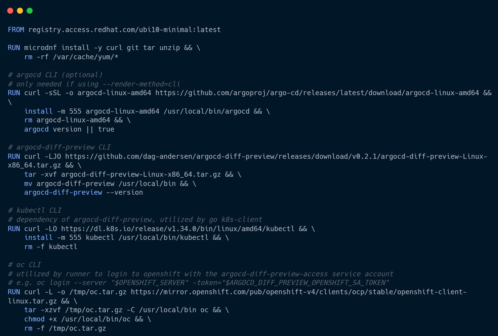

<!-- _class: lead -->

# GitOps Visibility 
## Präzise Argo CD diffs für jeden Pull Request 

---

<!-- _class: splitprofile -->
<style scoped>section { font-size: 20px; }</style>

# Speaker

<div>

## Robert Klonner
* DevOps Engineer @ WKO Inhouse GmbH
* Golden Kubestronaut
* GitOps, Platform Engineering, CI/CD

## Background
* 7 years DevOps – CI/CD, SDLC Toolchain, Operations
* 5 years Python scripting/Web development/Data processing
* STEM (MINT) studies: Meteorology
* HTL – Technical Informatics

## Contact
* ✉ r@klonner.cc
*  https://www.linkedin.com/in/klonner-robert/


</div>


---
# Agenda

1) das Problem 
2) das Tool
3) das Setup 
4) Use cases 
---
# Das Problem: git-diff vs rendered-diff

* In PRs schauen wir auf diff der templating Sprache (DRY) , nicht wie es gerendert aussieht 
* Ja man könnte diff manuell Ausführung, nicht praktikabel 
* Selbst wenn, gibt es mit Argo CD noch einen layer vor dem Cluster (App of apps, Application Sets )
---
# Problem 1
Screenshot diff

---
# Problem 2
Screenshot diff

---
# Problem 3
Screenshot diff

---
#  Die Lösung 
Etwas wie terraform Plan integriert in den CI Prozess wie Atlantis
Lösen den Kontext auf von templating Sprache und Argo Manifest und Visualisierung des diff von Desired Cluster Stage main vs Change 

---
# Argo CD Diff Preview 

Image von Logo 

---
# Beispiel Output diff Preview

Viellwicht sogar html5 Output 

---
# Funktionsweise 
Image aus Doku was im manifest getauscht wird  für zwei branches
Command argocd manifest ...

---
# Architektur - Ephemeral vs pre-installed


---

# Architektur - Pre-installed

## Dedizierte Argo CD Instanz


v

---

# Performance 

Ephemeral vs pre-installed

---

# Gitlab Runner image



---

# Operations
* Argo CD Operator (same as prod)
* Deploed over Argo itself
* Credential Templates as VSO/ESO secrets to integrate repo access
* Gitlab runner mit Argo CD diff Preview binary 
* Gitlab templates for central and optional pipeline Integration 

---
# Security 

* Namespace scoped Argo CD instance
    * No workloads can be deployed outside the argocd-diff-preview namespace
* Argo CD diff Preview binary (no DinD), no privileged mode

---
# Live Demo 

---
# Use case generell aus doku

Kustomize 
Helm 
Helm 

---
# Use case kustomize Back to base refactoring 

---
# Use case Helm envs to value hierarchy rafctoring

---
# Use case applicationset refactoring Produkt line

Image

---

# The Problem: Blind Merging
- Developers push to Git
- They pray it doesn't break the cluster
- **Cognitive Load:** High 🤯

---

# Image


---

# The Solution: Diff Previews
Automatically post the cluster impact back to the Pull Request.

**How it works:**
1. Git Webhook triggers CI
2. `argocd app diff --revision $PR_BRANCH`
3. Post output as PR Comment

---

# Implementation (Argo CD CLI)

```bash
# Get the diff between Git and Live Cluster
argocd app diff my-app \
  --revision feature-branch \
  --exit-code # Returns 1 if there is a diff

---
```bash
FROM registry.access.redhat.com/ubi10-minimal:latest

RUN microdnf install -y curl git tar unzip && \
    rm -rf /var/cache/yum/*

# argocd CLI (optional)
# only needed if using --render-method=cli
RUN curl -sSL -o argocd-linux-amd64 https://github.com/argoproj/argo-cd/releases/latest/download/argocd-linux-amd64 && \
    install -m 555 argocd-linux-amd64 /usr/local/bin/argocd && \
    rm argocd-linux-amd64 && \
    argocd version || true

# argocd-diff-preview CLI
RUN curl -LJO https://github.com/dag-andersen/argocd-diff-preview/releases/download/v0.2.1/argocd-diff-preview-Linux-x86_64.tar.gz && \
    tar -xvf argocd-diff-preview-Linux-x86_64.tar.gz && \
    mv argocd-diff-preview /usr/local/bin && \
    argocd-diff-preview --version

# kubectl CLI
# dependency of argocd-diff-preview, utilized by go k8s-client
RUN curl -LO https://dl.k8s.io/release/v1.34.0/bin/linux/amd64/kubectl && \
    install -m 555 kubectl /usr/local/bin/kubectl && \
    rm -f kubectl

# oc CLI
# utilized by runner to login to openshift with the argocd-diff-preview-access service account
# e.g. oc login --server "$OPENSHIFT_SERVER" -token="$ARGOCD_DIFF_PREVIEW_OPENSHIFT_SA_TOKEN"
RUN curl -L -o /tmp/oc.tar.gz https://mirror.openshift.com/pub/openshift-v4/clients/ocp/stable/openshift-client-linux.tar.gz && \
    tar -xzvf /tmp/oc.tar.gz -C /usr/local/bin oc && \
    chmod +x /usr/local/bin/oc && \
    rm -f /tmp/oc.tar.gz
```
---