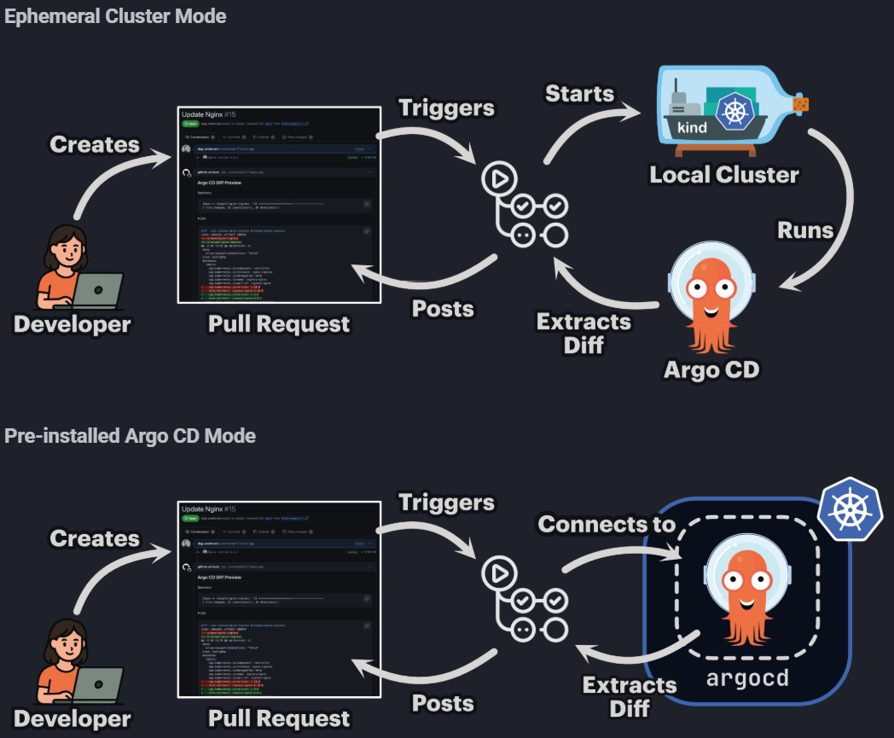
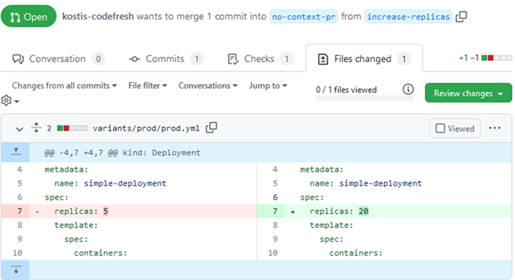

# GitOps Visibility 
## Präzise Argo CD diffs für jeden Pull Request 

---

<section id="speaker-page">
  <style>
    /* Das Styling greift nur innerhalb dieser Sektion mit der ID #speaker-page */
    #speaker-page .round-img {
      width: 250px !important;
      height: 250px !important;
      object-fit: cover;
      border-radius: 50%;
      border: 5px solid #93a1a1;
      margin: 0 auto 20px auto !important;
      display: block;
    }
    #speaker-page h2 {
      color: #93a1a1;
    }
  </style>

  # The speaker

<div style="display: flex; align-items: flex-start; justify-content: flex-start; gap: 20px;" data-markdown>
  
  <div style="flex: 2;"> <!-- 33% Breite -->

  

  ### Robert Klonner
  * *DevOps Engineer*
  * *Golden Kubestronaut*
  * GitOps, Platform Engineering, CI/CD
  </div>

  <div style="flex: 3; text-align: left;">
  <!-- Leerzeile für Markdown -->

### Background
* 7 years DevOps – CI/CD, SDLC Toolchain, Operations
* 5 years Python scripting/Web development/Data processing
* STEM (MINT) studies: Meteorology
* HTL – Technical Informatics

### Contact
* ✉ r@klonner.cc
* https://www.linkedin.com/in/klonner-robert/
  </div>

</div>

---
# Agenda

1) das Problem 
2) das Tool
3) das Setup 
4) Use cases 
---
# Das Problem: git-diff vs rendered-diff

* In PRs schauen wir auf diff der templating Sprache (DRY) , nicht wie es gerendert aussieht 
* Ja man könnte diff manuell Ausführung, nicht praktikabel 
* Selbst wenn, gibt es mit Argo CD noch einen layer vor dem Cluster (App of apps, Application Sets )
---
# Problem 1
Screenshot diff

---
# Problem 2
Screenshot diff

---
# Problem 3
Screenshot diff

---
#  Die Lösung

#### CI Prozess
triggern eines CI-Prozesses wie Atlantis für Terraform 

#### Rendern
Lösen den Kontext auf von templating Sprache und Argo Manifest

#### Diff Visualisierung
von Desired Cluster Stage main vs change 

---
# Argo CD Diff Preview 


---

# Beispieloutput eines Diff Previews

Interaktives HTML als Pull Request Kommentar

<iframe data-src="assets/ch1_argocd_example_diff.html" 
        style="background: #0d1117; border: 1px solid #30363d; border-radius: 6px;" 
        width="800" height="500">
</iframe>

---
# Funktionsweise 
Image aus Doku was im manifest getauscht wird  für zwei branches
Command argocd manifest ...

---
# Ephemeral vs pre-installed

<div style="display: flex; align-items: center;" data-markdown>

  <div style="flex: 3;"> <!-- 66% Breite -->

  
  </div>

  <div style="flex: 2;"> <!-- 33% Breite -->

  - Punkt 1
  - Punkt 2
  </div>
</div>

---

# Pre-installed


---

# Performance 

Ephemeral vs pre-installed

---

# Gitlab Runner image


```bash [6-11|13-17|19-23|25-31]
FROM registry.access.redhat.com/ubi10-minimal:latest

RUN microdnf install -y curl git tar unzip && \
    rm -rf /var/cache/yum/*

# argocd CLI (optional)
# only needed if using --render-method=cli
RUN curl -sSL -o argocd-linux-amd64 https://github.com/argoproj/argo-cd/releases/latest/download/argocd-linux-amd64 && \
    install -m 555 argocd-linux-amd64 /usr/local/bin/argocd && \
    rm argocd-linux-amd64 && \
    argocd version || true

# argocd-diff-preview CLI
RUN curl -LJO https://github.com/dag-andersen/argocd-diff-preview/releases/download/v0.2.1/argocd-diff-preview-Linux-x86_64.tar.gz && \
    tar -xvf argocd-diff-preview-Linux-x86_64.tar.gz && \
    mv argocd-diff-preview /usr/local/bin && \
    argocd-diff-preview --version

# kubectl CLI
# dependency of argocd-diff-preview, utilized by go k8s-client
RUN curl -LO https://dl.k8s.io/release/v1.34.0/bin/linux/amd64/kubectl && \
    install -m 555 kubectl /usr/local/bin/kubectl && \
    rm -f kubectl

# oc CLI
# utilized by runner to login to openshift with the argocd-diff-preview-access service account
# e.g. oc login --server "$OPENSHIFT_SERVER" -token="$ARGOCD_DIFF_PREVIEW_OPENSHIFT_SA_TOKEN"
RUN curl -L -o /tmp/oc.tar.gz https://mirror.openshift.com/pub/openshift-v4/clients/ocp/stable/openshift-client-linux.tar.gz && \
    tar -xzvf /tmp/oc.tar.gz -C /usr/local/bin oc && \
    chmod +x /usr/local/bin/oc && \
    rm -f /tmp/oc.tar.gz
```

---

# Gitlab pipeline template

```yaml []
default:
  tags:
    - openshift-gitlab-runner

stages:
  - diff

diff:
  image: <your-registry>/argocd-diff-preview-runner
  variables:
    OPENSHIFT_SERVER: "<your-openshift-server-url>"
    GITLAB_TOKEN: $GITLAB_PAT
  script:
    - echo "******** Running analysis ********"
    - git clone ${CI_REPOSITORY_URL} base-branch --depth 1 -q 
    - git clone ${CI_REPOSITORY_URL} target-branch --depth 1 -q -b ${CI_MERGE_REQUEST_SOURCE_BRANCH_NAME}
    # initiate kubeconfig creation that argocd-diff-preview can use
    - oc login --server "$OPENSHIFT_SERVER" --token="$ARGOCD_DIFF_PREVIEW_OPENSHIFT_SA_TOKEN"
    - |
      argocd-diff-preview \
        --repo ${CI_MERGE_REQUEST_PROJECT_PATH} \
        --base-branch main \
        --target-branch ${CI_MERGE_REQUEST_SOURCE_BRANCH_NAME} \
        --argocd-namespace=argocd-diff-preview \
        --create-cluster=false
    - |
      jq --null-input --rawfile msg $(pwd)/output/diff.md '{body: $msg}' > pr_comment.json
      NOTE_ID=$(curl --silent --header "PRIVATE-TOKEN: ${GITLAB_TOKEN}" \
          "${CI_API_V4_URL}/projects/${CI_PROJECT_ID}/merge_requests/${CI_MERGE_REQUEST_IID}/notes" | \
          jq '.[] | select(.body | test("Argo CD Diff Preview")) | .id')

      if [[ -n "$NOTE_ID" ]]; then
          echo "Deleting existing comment (ID: $NOTE_ID)..."

          curl --silent --request DELETE --header "PRIVATE-TOKEN: ${GITLAB_TOKEN}" \
              --url "${CI_API_V4_URL}/projects/${CI_PROJECT_ID}/merge_requests/${CI_MERGE_REQUEST_IID}/notes/${NOTE_ID}"
      fi

      echo "Adding new comment..."
      curl --silent --request POST --header "PRIVATE-TOKEN: ${GITLAB_TOKEN}" \
          --header "Content-Type: application/json" \
          --url "${CI_API_V4_URL}/projects/${CI_PROJECT_ID}/merge_requests/${CI_MERGE_REQUEST_IID}/notes" \
          --data @pr_comment.json > /dev/null

      echo "Comment added!"
  rules:
    - if: $CI_PIPELINE_SOURCE == "merge_request_event"
```

---

# Operations
* Argo CD Operator (same as prod)
* Deploed over Argo itself
* Credential Templates as VSO/ESO secrets to integrate repo access
* Gitlab runner mit Argo CD diff Preview binary 
* Gitlab templates for central and optional pipeline Integration 

---
# Security 

* Namespace scoped Argo CD instance
    * No workloads can be deployed outside the argocd-diff-preview namespace
* Argo CD diff Preview binary (no DinD), no privileged mode

---
# Live Demo 

---
# Use case generell aus doku

Kustomize 
Helm 
Helm 

---
# Use case kustomize Back to base refactoring 

---
# Use case Helm envs to value hierarchy rafctoring

---
# Use case applicationset refactoring Produkt line

Image

---

# The Problem: Blind Merging
- Developers push to Git
- They pray it doesn't break the cluster
- **Cognitive Load:** High 🤯

---

# Image



---

# The Solution: Diff Previews
Automatically post the cluster impact back to the Pull Request.

**How it works:**
1. Git Webhook triggers CI
2. `argocd app diff --revision $PR_BRANCH`
3. Post output as PR Comment

---

# Implementation (Argo CD CLI)

```bash
# Get the diff between Git and Live Cluster
argocd app diff my-app \
  --revision feature-branch \
  --exit-code # Returns 1 if there is a diff

---

# Slide 1: Einführung
Das ist der erste Text.

- Punkt A <!-- .element: class="fragment" -->
- Punkt B <!-- .element: class="fragment" -->

---

# Slide 2: Animationen
Dieser Block erscheint animiert.
<!-- .element: class="fragment fade-up" -->

---

# Slide 3: Code-Fragmente
```javascript [1|3|5]
// Schrittweise Code-Hervorhebung
console.log("Start");
let x = 10;
x += 5;
console.log(x);
```

---

# Code-Walkthrough Demo

Hier erklären wir eine Funktion Schritt für Schritt.

```javascript [1|3-4|6-9|11]
function greet(name) {
  // 1. Initialisierung
  const greeting = "Hallo";
  const message = `${greeting}, ${name}!`;

  // 2. Logik-Check
  if (!name) {
    return "Wer da?";
  }

  return message;
}
```
<!-- .element: class="fragment" -->

---

# Animierter Code-Vergleich

Du kannst auch den Code selbst als Fragment behandeln.

### Version 1 (Basis)
```python
def add(a, b):
    return a + b
```
<!-- .element: class="fragment" -->

### Version 2 (Mit Typen)
```python
def add(a: int, b: int) -> int:
    return a + b
```
<!-- .element: class="fragment" -->

---

# Deep Dive: Große Klasse

Wir springen durch die Logik dieser Klasse.

```javascript [1-5|25-30|50-55|1-60]
class UserManager {
  constructor() {
    this.users = [];
    console.log("Init...");
  }

  // ... viele Zeilen Code ...

  async fetchUsers() {
    const response = await fetch('/api/users');
    this.users = await response.json();
    return this.users;
  }

  // ... noch mehr Code ...

  findUserById(id) {
    return this.users.find(u => u.id === id);
  }

  // Am Ende alles zeigen
  logoutAll() {
    this.users = [];
  }
}
```
---

### Die Funktionsweise im Detail

*   **Automatisches Scrollen:** Wenn der Codeblock eine `max-height` hat (Standard in den meisten Themes), scrollt reveal.js die aktuell hervorgehobenen Zeilen automatisch in die Mitte des Sichtfelds.
*   **Syntax `[1-5|25-30]`**: 
    1. Klick: Fokus auf den Constructor (oben).
    2. Klick: Sprung zur Mitte der Datei (`fetchUsers`).
    3. Klick: Sprung zum Ende der Datei (`findUserById`).
    4. Klick: Zoomt heraus und zeigt alles (`1-60`).

---

# Test-Sprung
```javascript [1-2|3|5]
const eins = 1;
const zwei = 2;
const drei = 3;
const vier = 4;
const fünf = 5;
```
