# GitOps Visibility
## Präzise Argo CD diffs für jeden Pull Request 

---

<section id="speaker-page">
  <style>
    /* Das Styling greift nur innerhalb dieser Sektion mit der ID #speaker-page */
    #speaker-page .round-img {
      width: 250px !important;
      height: 250px !important;
      object-fit: cover;
      border-radius: 50%;
      border: 5px solid #93a1a1;
      margin: 0 auto 20px auto !important;
      display: block;
    }
    #speaker-page h2 {
      color: #93a1a1;
    }
  </style>

  # Über mich

<div style="display: flex; align-items: flex-start; justify-content: flex-start; gap: 20px;" data-markdown>
  
  <div style="flex: 2;"> <!-- 33% Breite -->

  

  ### Robert Klonner
  * *DevOps Engineer*
  * *Golden Kubestronaut*
  * GitOps, Platform Engineering, CI/CD
  </div>

  <div style="flex: 3; text-align: left;">
  <!-- Leerzeile für Markdown -->

### Background
* 7 years DevOps – CI/CD, SDLC Toolchain, Operations
* 5 years Python scripting/Web development/Data processing
* STEM (MINT) studies: Meteorology
* HTL – Technical Informatics

### Contact
* ✉ r@klonner.cc
* https://www.linkedin.com/in/klonner-robert/
  </div>

</div>

---
# Agenda

* Kapitel 1: Das Problem

* Kapitel 2: Eine Lösung

* Kapitel 3: Produktives Setup 

* Kapitel 4: Use cases 

---

# Kapitel 1: Das Problem

---

# DRY in GitOps

* **Application Manifests** → Helm | Kustomize

* **ArgoCD (Application) Manifests** → ApplicationSets | App of apps

* 👍 Wartbarkeit und Effizienz

* 👎 Hohe Cognitive Load bei Änderungen → 🤯


---

# git-diff | rendered-diff | reconciler-diff

* Pull requests - git-diff der Templating Sprache (DRY), nicht gerendert!

* Dev lokal getestet, aber keine Info für Reviewer

* Reviewer könnte rendered-diff manuell generieren → nicht praktikabel + fehleranfällig

* Darüberhinaus gibt es mit Argo CD noch einen Layer vor dem Cluster (App of apps, Application Sets)

---
# Beispiel - Änderung Replicas

Task: Erhöhung der Replicas für produktiv (Kostis Kapelonis)
<!-- 
 -->

<div class="r-stack">
  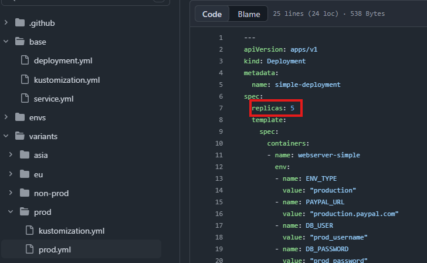
  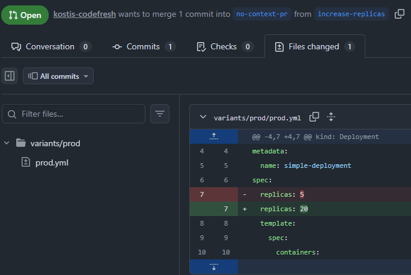
  <div class="fragment" style="width: 70%; min-width: 400px;">

```bash
  kustomize build envs/prod-eu/
```

  ```yaml []
apiVersion: apps/v1
kind: Deployment
metadata:
  annotations:
    codefresh.io/app: simple-go-app
  name: prod-eu-simple-deployment
  namespace: prod
spec:
  replicas: 8
  selector:
    matchLabels:
      app: trivial-go-web-app
  ```
  </div>
  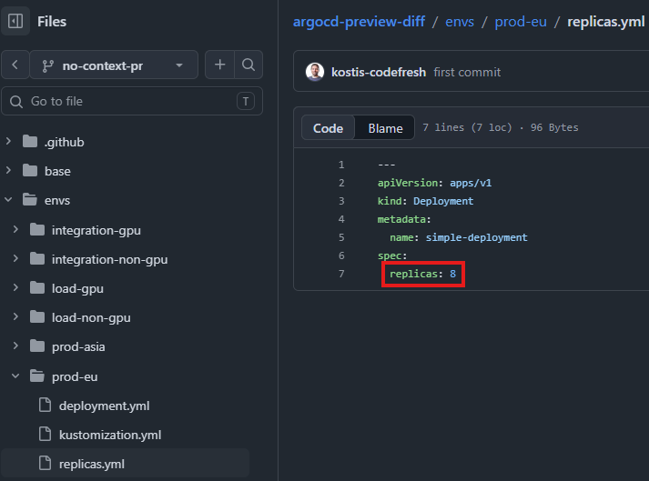
</div>
---

# Beispiel - Änderung Replicas

#### Möglichkeiten für Diff-Generierung in der CLI

<div style="font-size: 0.6em;">

| Ebene | Befehl | Was wird gerendert? | Fokus |
| :--- | :--- | :--- | :--- |
| **Tooling** | `helm template` / `kustomize build` | Kubernetes Ressourcen (lokal) | Validierung der reinen Helm/Kustomize-Logik ohne Argo CD. |
</div>

---

# Beispiel - Änderung an ApplicationSet


<div style="display: flex; align-items: center;" data-markdown>

  <div style="flex: 3;"> <!-- 66% Breite -->

  <!-- 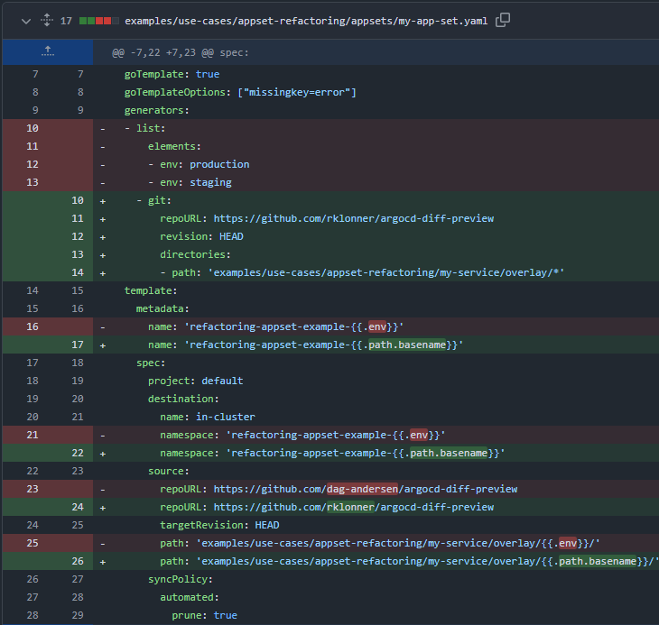 -->
  
  </div>

  <div style="flex: 2;"> <!-- 33% Breite -->

  - Liefert das geänderte ApplicationSet alles wie vorher für staging und production aus?

  - Dazu ist Argo CD Objekt Rendering notwendig → Argo Template + Kustomize Template 
  </div>
</div>

---

# Beispiel - Änderung an ApplicationSet

#### Möglichkeiten für Diff-Generierung in der CLI

<div style="font-size: 0.6em;">

| Ebene | Befehl | Was wird gerendert? | Fokus |
| :--- | :--- | :--- | :--- |
| **Template** | `argocd appset generate -o yaml` | `kind: Application` | Namen, Ziel-Cluster, Pfade & Parameter-Mapping. |
| **App-Logik** | `argocd app manifests <NAME>` | `kind: Deployment`, etc. | Der tatsächliche Kubernetes-Code (nur wenn App existiert). |
| **Tooling** | `helm template` / `kustomize build` | Kubernetes Ressourcen (lokal) | Validierung der reinen Helm/Kustomize-Logik ohne Argo CD. |
| **Deep Dive** | `argocd-util app generate-manifests` | Finales Manifest (Argo-Style) | Simuliert das serverseitige Rendering inklusive Plugins. |
</div>

---

# Kapitel 2: Eine Lösung

---

# Lösungsansätze

<ul>
<li class="fragment">

**Lokales diff von kustomize/helm**
  * `helm template` oder `kustomize build` aufwendig
  * `argocd app diff` bebntöigt Credentials in CI Pipeline
</li>

<li class="fragment">

**CI Pipeline Diff Funktionalität**
  * per Pipeline 2x rendern (`helm template | kustomize build`)
  * ist aber aufwending und unterschiedlich per Tool/Projekt
</li>

<li class="fragment">

**Argo CD Diff in UI**
  * auto-sync muss deaktiviert sein
  * Diff erst sichtbar wenn PR gemergt ist
</li>

<li class="fragment">

**Rendered Manifest Pattern**
  * zwei Branches/Repos um gerendertes Manifeste zu speichern
  * zusätzliche Komplexität
  * z.B. Argo CD Source Hydrator
</ul>
---

#  Nötige Schritte

<div class="fragment">

## Einbinden in CI Prozess 
triggern eines CI-Prozesses wie Atlantis für Terraform → nicht lokal
</div>

<div class="fragment">

## Rendern aller Templating-Layer
auflösen der Kontexte von Helm | Kustomize + Argo CD Manifest
</div>

<div class="fragment">

## Diff Visualisierung
von Desired Cluster State - main vs change 
</div>

---
# Gibt es dafür ein fertiges Tool?

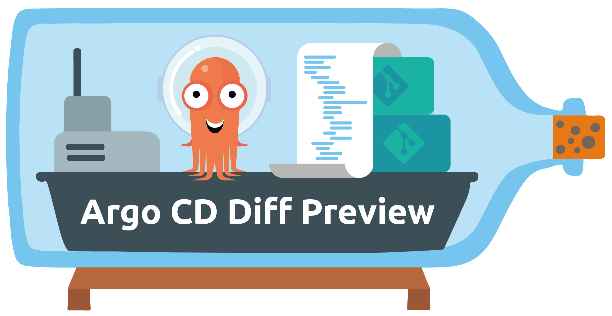
<!-- .element: class="fragment" -->

---

# Argo CD Diff Preview - Funktionsweise

<div style="display: flex; align-items: center; gap: 50px;" data-markdown>

  <div style="flex: 1;"> 
    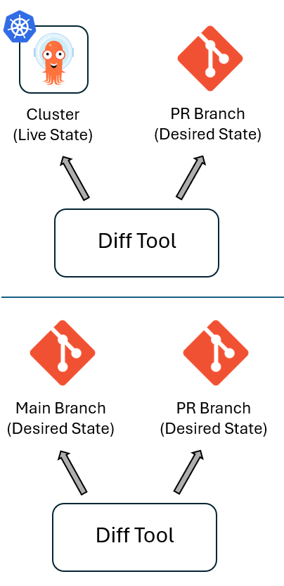

  </div>

  <div style="flex: 4; text-align: left;"> <!-- 33% Breite -->

#### Vergleich Desired State von zwei Branches → reproduzierbar
  * Nicht Live State (Temporärer Drift, Admission webhooks, Sync delays ...)
  * GitOps == Auto-sync aktiv → Vergleich mit Desired State genügt

#### Rendering mit Argo CD durchführen
  * Funktionalität sehr umfangreich, nicht sinnvoll außerhalb zu reproduzieren
  </div>
</div>

---

# Argo CD Diff Preview - Funktionsweise

Beispiel Ausführung

```bash [2-3|6-7|14-15|16-17]
# Get Argo CD Manifests current state on main
git clone https://github.com/dag-andersen/argocd-diff-preview \
          base-branch --depth 1 -q 

# Get Argo CD Manifests on target branch
git clone https://github.com/dag-andersen/argocd-diff-preview \
          target-branch --depth 1 -q -b helm-example-3

# Execute Argo CD Diff Preview (e.g. in a container)
docker run \
  --network host \
  -v /var/run/docker.sock:/var/run/docker.sock \
  -v $(pwd)/output:/output \
  -v $(pwd)/base-branch:/base-branch \
  -v $(pwd)/target-branch:/target-branch \
  -e REPO=dag-andersen/argocd-diff-preview \
  -e TARGET_BRANCH=helm-example-3 \
  dagandersen/argocd-diff-preview:v0.2.1
```

---

# Argo CD Diff Preview - Beispiel Output

Interaktives HTML als Pull Request Kommentar

<iframe data-src="assets/ch1_argocd_example_diff.html" 
        style="background: #0d1117; border: 1px solid #30363d; border-radius: 6px;" 
        width="800" height="500">
</iframe>

---

# Argo CD Diff Preview - Funktionsweise

<div style="display: flex; align-items: center;" data-markdown>

  <div style="flex: 3;"> 
    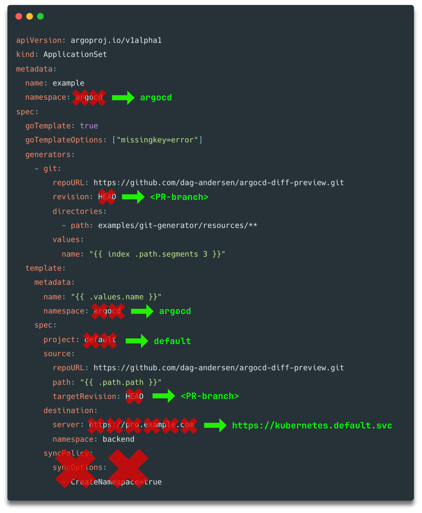
  </div>

  <div style="flex: 2; text-align: left;"> <!-- 33% Breite -->

### 1. Application Manifests vorbereiten

* Fetch
* Select/Filter
* Patch 
  </div>
</div>

---

# Argo CD Diff Preview - Funktionsweise

<div style="display: flex; align-items: center; gap: 50px;" data-markdown>

  <div style="flex: 3;"> 
    
  </div>

  <div style="flex: 3; text-align: left;"> <!-- 33% Breite -->

### 2. Argo CD Instanz zum Rendern

#### Ephemeral
* Kind cluster erstellen
* Argo CD deployen

#### Pre-Installed
* Bereitstellen einer eigenen Argo CD Instanz
  </div>
</div>

---

# Argo CD Diff Preview - Funktionsweise

<div style="display: flex; align-items: center; gap: 50px;" data-markdown>

  <div style="flex: 2;"> 
    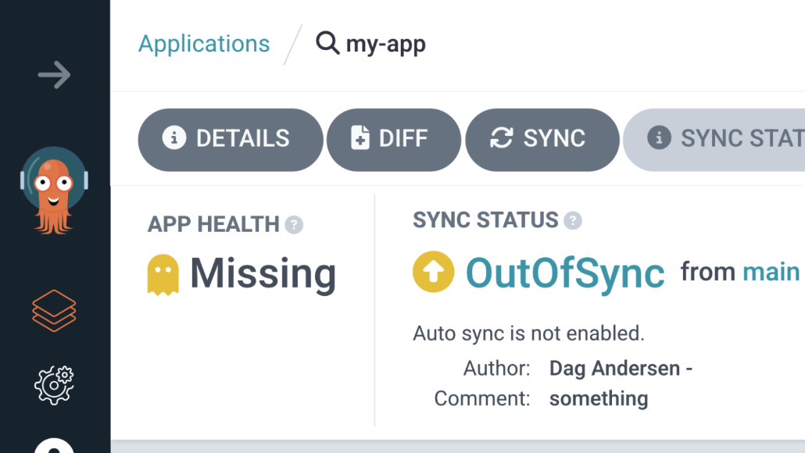
  </div>

  <div style="flex: 3; text-align: left;"> <!-- 33% Breite -->

### 3. Argo CD Applications deployen

* ApplicationSets und App of Apps auflösen → Applications
* Rendern der Applications für main und change in Argo CD
* Applications erstellen aber Sync ist deaktiviert
* Extrahieren der zwei Varianten
  ```bash
  argocd app manifests <app-name>
  ```
  </div>
</div>

---

# Argo CD Diff Preview - Funktionsweise

### 4. Diff erzeugen
Vergleich Main vs Target Branch per Argo CD Application:

* Hinzugefügte Applications - Neu im Target Branch
* Entfernte Applications - Gelöscht im Target Branch
* Geänderte Applications - Geändert zwischen Branches
* Unveränderte Applications - Unverändert (gefiltert im Output)

<div style="font-size: 0.6em; margin-top: 1em">

| File | Description |
| :--- | :--- |
| `./output/diff.md` | Markdown diff ... |
| `./output/diff.html` | HTML diff ... |
</div>

---

# Argo CD Diff Preview - Multi Repo Support

<div style="font-size: 0.6em;">

| Repository | Contains |
| :--- | :--- |
| Application Repo | Argo CD Application and ApplicationSet manifests |
| Resource Repo | Kubernetes resources (Helm charts, Kustomize overlays, plain YAML) |
</div>

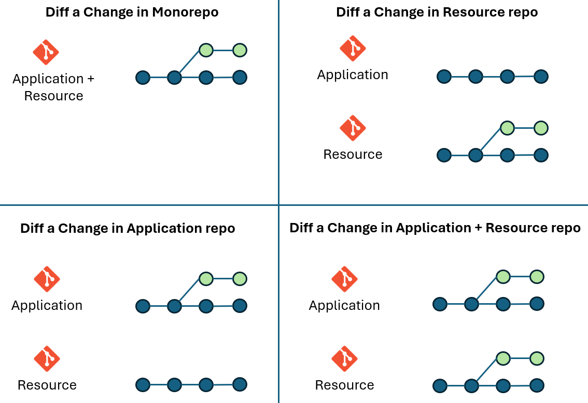

---

# Kapitel 3: Produktives Setup

---

# Fokus auf
<div class="fragment">

## Performance
für Feedback im PR (Sekunden)
</div>

<div class="fragment">

## Security
produktiven Cluster absichern, CI Zugriffe
</div>

<div class="fragment">

## Maintenance | Operations
Aufwand minimieren
</div>

---

# Argo CD Installation für Diff Preview

<div style="text-align: left;" class="fragment">

### Ephemeral

* ✅ Kein Setup nötig
* ✅ Komplette Isolation
* ✅ Funktioniert mit jedem CI/CD System (und auch lokal)
* ❌ Langsam (~60 Sekunden Overhead pro Run)
* ❌ Ressourcenintensiv (erstellt neuen Cluster pro Run)

</div>

<div style="text-align: left;" class="fragment">

### Pre-Installed
* ✅ Schnelle Ausführung (Overhead nur Gitlab Runner Spin-up-time)
* ✅ Netzwerk Isolierung (kein Internet Zugriff am Cluster)
* ✅ Keine Cluster Credentials in CI/CD pipeline (Verwendung Service Account innerhalb des Clusters, Argo CD hat alle Credentials)
* ❌ Komplexer (braucht Self-hosted Runners + eigenes Argo CD)
</div>

---

# Argo CD Pre-installed

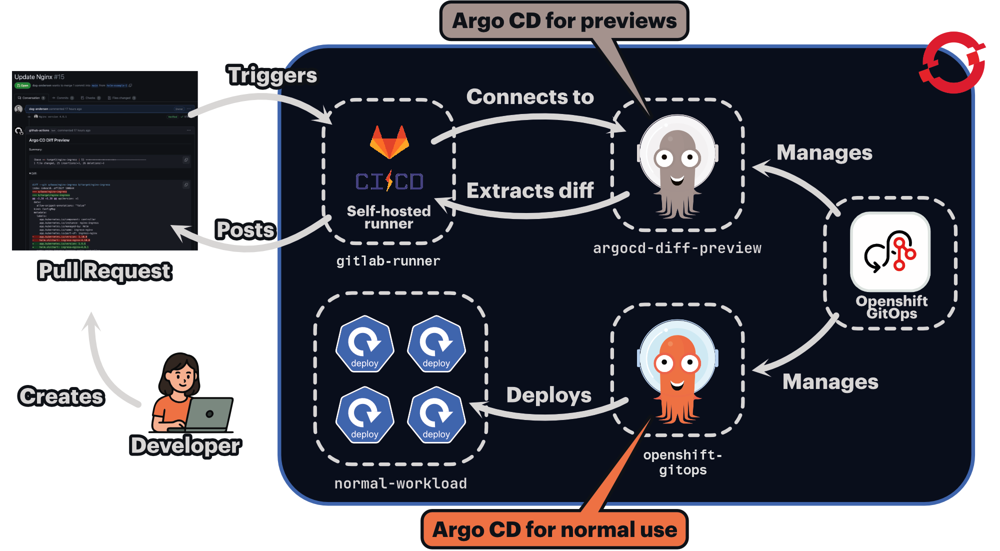

---

# Argo CD Pre-installed - Deployment

<div style="display: flex; align-items: center; gap: 50px;" data-markdown>
  <div style="flex: 3; text-align: left;" class="fragment"> <!-- 33% Breite -->

## Openshift GitOps Operator
* Deklarative Installieren der eigenen Instanz
* Gleiche Version wie produtives Argo CD
* Upgrades laufen mit

<div class="fragment">

## Configuration via GitOps

* Service Account (Gitlab runner access)
* RBAC Service Account
* SSH known hosts, TLS certs
* Repo Credential Templates (VSO|ESO)
* Cluster Credentials (VSO|ESO)
...
</div>
</div>

  <div style="flex: 1;" data-markdown> <!-- .element: class="fragment fade-up" -->
    

#### Namespaced 
#### (nicht cluster-wide)
  </div>
</div>
---

# Gitlab Runner image

Argo CD Diff Preview binary (kein DinD) + Dependencies

```bash [6|13|19|25]
FROM registry.access.redhat.com/ubi10-minimal:latest

RUN microdnf install -y curl git tar unzip && \
    rm -rf /var/cache/yum/*

# argocd CLI (optional)
# only needed if using --render-method=cli
RUN curl -sSL -o argocd-linux-amd64 https://github.com/argoproj/argo-cd/releases/latest/download/argocd-linux-amd64 && \
    install -m 555 argocd-linux-amd64 /usr/local/bin/argocd && \
    rm argocd-linux-amd64 && \
    argocd version || true

# argocd-diff-preview CLI
RUN curl -LJO https://github.com/dag-andersen/argocd-diff-preview/releases/download/v0.2.1/argocd-diff-preview-Linux-x86_64.tar.gz && \
    tar -xvf argocd-diff-preview-Linux-x86_64.tar.gz && \
    mv argocd-diff-preview /usr/local/bin && \
    argocd-diff-preview --version

# kubectl CLI
# dependency of argocd-diff-preview, utilized by go k8s-client
RUN curl -LO https://dl.k8s.io/release/v1.34.0/bin/linux/amd64/kubectl && \
    install -m 555 kubectl /usr/local/bin/kubectl && \
    rm -f kubectl

# oc CLI
# utilized by runner to login to openshift with the argocd-diff-preview-access service account
# e.g. oc login --server "$OPENSHIFT_SERVER" -token="$ARGOCD_DIFF_PREVIEW_OPENSHIFT_SA_TOKEN"
RUN curl -L -o /tmp/oc.tar.gz https://mirror.openshift.com/pub/openshift-v4/clients/ocp/stable/openshift-client-linux.tar.gz && \
    tar -xzvf /tmp/oc.tar.gz -C /usr/local/bin oc && \
    chmod +x /usr/local/bin/oc && \
    rm -f /tmp/oc.tar.gz
```

---

# Gitlab pipeline template

zentral, versioniert

```yaml [9|10-16|19-25|27-29|31-33|35-41|49-54|56-60|63-64]
default:
  tags:
    - openshift-gitlab-runner

stages:
  - diff

diff:
  image: <your-registry>/argocd-diff-preview-runner
  variables:
    ARGO_MANIFEST_REPO: ""
    ARGO_MANIFEST_REPO_TARGET_BRANCH: ${CI_MERGE_REQUEST_SOURCE_BRANCH_NAME}
    K8S_MANIFEST_BRANCH: ${CI_MERGE_REQUEST_SOURCE_BRANCH_NAME}
    ARGOCD_DIFF_PREVIEW_FLAGS: ""  # e.g. "--debug"
    OPENSHIFT_CLUSTER: "<your-openshift-cluster-url>"
    GITLAB_TOKEN: $GITLAB_PAT
  script:
    - echo "******** Running analysis ********"
    # Repo location of the ArgoCD ApplicationSet manifests
    - |
      if [ -z "$ARGO_MANIFEST_REPO" ]; then
        ARGO_MANIFEST_REPO=${CI_REPOSITORY_URL}
      else
        ARGO_MANIFEST_REPO="https://$ARGOCD_DIFF_PREVIEW_REPO_USER:$ARGOCD_DIFF_PREVIEW_REPO_PASSWORD@$ARGO_MANIFEST_REPO"
      fi

    - git clone ${ARGO_MANIFEST_REPO} base-branch --depth 1  -q
    - git clone ${ARGO_MANIFEST_REPO} target-branch --depth 1 -q \
      -b ${ARGO_MANIFEST_REPO_TARGET_BRANCH}

    # initiate kubeconfig creation that argocd-diff-preview can use
    - oc login --server "$OPENSHIFT_CLUSTER" \
               --token="$ARGOCD_DIFF_PREVIEW_OPENSHIFT_SA_TOKEN"
    - |
      argocd-diff-preview \
        --repo ${CI_MERGE_REQUEST_PROJECT_PATH} \
        --base-branch main \
        --target-branch ${K8S_MANIFEST_BRANCH} \
        --argocd-namespace=inh-devops-argocd-diff-preview \
        ${ARGOCD_DIFF_PREVIEW_FLAGS} \
        --create-cluster=false
    - |
      # Deleting old PR comment if exists
      jq --null-input --rawfile msg $(pwd)/output/diff.md '{body: $msg}' > pr_comment.json
      NOTE_ID=$(curl --silent --header "PRIVATE-TOKEN: ${GITLAB_TOKEN}" \
          "${CI_API_V4_URL}/projects/${CI_PROJECT_ID}/merge_requests/${CI_MERGE_REQUEST_IID}/notes" | \
          jq '.[] | select(.body | test("Argo CD Diff Preview")) | .id')

      if [[ -n "$NOTE_ID" ]]; then
          echo "Deleting existing comment (ID: $NOTE_ID)..."

          curl --silent --request DELETE --header "PRIVATE-TOKEN: ${GITLAB_TOKEN}" \
              --url "${CI_API_V4_URL}/projects/${CI_PROJECT_ID}/merge_requests/${CI_MERGE_REQUEST_IID}/notes/${NOTE_ID}"
      fi

      echo "Adding new PR comment..."
      curl --silent --request POST --header "PRIVATE-TOKEN: ${GITLAB_TOKEN}" \
          --header "Content-Type: application/json" \
          --url "${CI_API_V4_URL}/projects/${CI_PROJECT_ID}/merge_requests/${CI_MERGE_REQUEST_IID}/notes" \
          --data @pr_comment.json > /dev/null

      echo "Comment added!"
  rules:
    - if: $CI_PIPELINE_SOURCE == "merge_request_event"
```

---

# Gitlab pipeline - Diff Preview Aktivierung

* opt-in (Aktivierung pro Pipeline)
* Minimale Konfiguration

```yaml []
stages:
  - argocd-diff-preview
include:
  - project: 'gitlab-ci-templates'
    ref: 'main'
    file: 'argocd-diff-preview-merge-request.yml'
diff:
  extends: .template-argocd-diff-preview
  stage: argocd-diff-preview
  variables:
    ARGOCD_DIFF_PREVIEW_FLAGS: "--debug  --max-diff-length 131072"
```

---

# Gitlab Runner Execution time

* Gitlab Runner ~10-20 Sekunden
* Diff Preview ~10 Sekunden

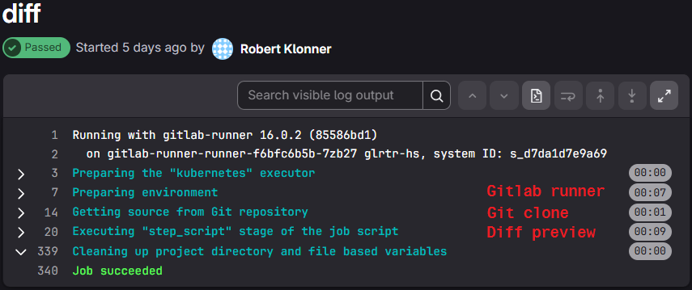

---
# Live Demo 

---
# Use case Helm envs to value hierarchy refactoring

---
# Use case Produkt line ApplicationSet 

Image

---

# Zero-Change PR - Kustomize back-to-base refactoring 

---

# Fragen?

<div style="display: flex; align-items: center; gap: 50px;" data-markdown>

  <div style="flex: 1;" data-markdown>

  #### Feedback Vortrag

  
  </div>
  <div style="flex: 1;">

  #### Let's connect

  
</div>
