# GitOps Visibility
## Präzise Argo CD Diffs für jeden Pull Request 

---

<section id="speaker-page">
  <style>
    /* Das Styling greift nur innerhalb dieser Sektion mit der ID #speaker-page */
    #speaker-page .round-img {
      width: 250px !important;
      height: 250px !important;
      object-fit: cover;
      border-radius: 50%;
      border: 5px solid #93a1a1;
      margin: 0 auto 20px auto !important;
      display: block;
    }
    #speaker-page h2 {
      color: #93a1a1;
    }
  </style>

  # Über mich

<div style="display: flex; align-items: center; justify-content: center; gap: 20px;" data-markdown>
  
  <div style="flex: 2; font-size: 0.8em;"> <!-- 33% Breite -->

  

### Robert Klonner

  </div>

  <div style="flex: 3; text-align: left; font-size: 0.8em; display: grid; align-content: center;"
  <!-- Leerzeile für Markdown -->

### Allgemeines
  * *DevOps Engineer @ WKO Inhouse GmbH*
  * *CNCF Golden Kubestronaut*
  * GitOps, Platform Engineering, CI/CD

### Erfahrung
* DevOps – CI/CD, SDLC Toolchain, Operations
* Python Developer - Scripting, Web development, Data processing

### Kontakt
* r@klonner.cc
* https://www.linkedin.com/in/klonner-robert/
  </div>

</div>

---
# Agenda

* Kapitel 1: Das Problem mit Templating Ebenen in GitOps

* Kapitel 2: Eine Lösung für mehr Sichtbarkeit

* Kapitel 3: Ein produktives Setup 

* Kapitel 4: Use cases 

---

# Kapitel 1: Das Problem mit Templating Ebenen in GitOps

---

# DRY in GitOps

* **Resource Manifests** → Helm | Kustomize

* **Application Manifests (Argo CD)** → ApplicationSets | App of apps

* 👍 Wartbarkeit und Effizienz

* 👎 Hohe Cognitive Load bei Änderungen → 🤯


---

# git-diff | rendered-diff | argocd-diff

* Pull requests - git-diff der Templating Sprache (DRY), nicht gerendert!

* Dev hat Template (vielleicht) lokal gerendert, aber keine Info für Reviewer

* Reviewer könnte rendered-diff manuell generieren → nicht praktikabel + fehleranfällig

* Mit Argo CD gibt es noch einen Layer vor dem Cluster (App of apps, Application Sets)

---

# Beispiel - Änderung Replicas Helm

Task: Erhöhung der Replicas für das produktiv System

<div class="r-stack">
  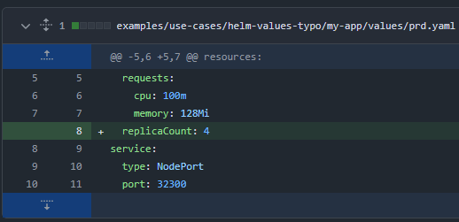

  <div class="fragment" style="background: #002b36; color: #93a1a1; padding: 20px; max-width: 400px;">
    <p>We merge PR</p>
    <p>Argo CD syncs</p>
    <p>Nothing happens?</p>
    <p>Debugging... 😕</p>
  </div>

  <div class="fragment" style="width: 70%; min-width: 400px;">

```bash
  helm template my-app/ -f values/prd.yaml
```

  ```yaml [12]
apiVersion: apps/v1
kind: Deployment
metadata:
  name: test-namespace
  labels:
    helm.sh/chart: myApp-0.1.0
    app.kubernetes.io/name: myApp
    app.kubernetes.io/instance: release-name
    app.kubernetes.io/version: "1.16.0"
    app.kubernetes.io/managed-by: Helm
spec:
  replicas: 1
  selector:
    matchLabels:
      app.kubernetes.io/name: myApp
      app.kubernetes.io/instance: release-name
  ```
  </div>

  
</div>

---

# Beispiel - Conditionals in Helm Chart

<div style="display: flex; align-items: center;" data-markdown>
  <div style="flex: 3;"> <!-- 66% Breite -->

  <!--  -->
  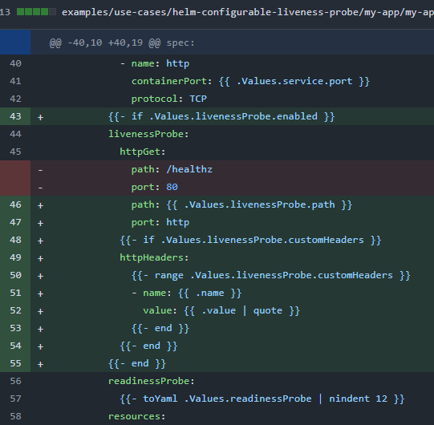
  </div>

  <div style="flex: 2;"> <!-- 33% Breite -->

  - Task: Konfigurierbare Liveness Probe

  - Max: "Bitte schau dir diesen PR an - ist nur eine kleine Änderung an der Liveness Probe..."

  - Reviewer: 🤔
  </div>
</div>

---

# Beispiel - Änderung Replicas

#### Möglichkeiten für Diff-Generierung in der CLI

<div style="font-size: 0.6em;">

| Ebene | Befehl | Was wird gerendert? | Fokus |
| :--- | :--- | :--- | :--- |
| **Tooling** | `helm template` / `kustomize build` | Kubernetes Ressourcen (lokal) | Validierung der reinen Helm/Kustomize-Logik ohne Argo CD. |
</div>

---

# Beispiel - Änderung an ApplicationSet


<div style="display: flex; align-items: center;" data-markdown>

  <div style="flex: 3;"> <!-- 66% Breite -->

  <!--  -->
  
  </div>

  <div style="flex: 2;"> <!-- 33% Breite -->

  - Task: Refactoring List Generator → Git Generator Directories

  - Liefert das geänderte ApplicationSet alles wie vorher für staging und production aus? 🤔

  - Für Verifikation ist Argo CD Objekt Rendering notwendig
  </div>
</div>

---

# Beispiel - Änderung an ApplicationSet

#### Möglichkeiten für Diff-Generierung in der CLI

<div style="font-size: 0.6em;">

| Ebene | Befehl | Was wird gerendert? | Fokus |
| :--- | :--- | :--- | :--- |
| **Template** | `argocd appset generate -o yaml` | `kind: Application` | Namen, Ziel-Cluster, Pfade & Parameter-Mapping. |
| **App-Logik** | `argocd app manifests <NAME>` | `kind: Deployment`, etc. | Der tatsächliche Kubernetes-Code (nur wenn App existiert). |
</div>

---

# Kapitel 2: Eine Lösung für mehr Sichtbarkeit

---

# Lösungsansätze

<ul>
<li class="fragment">

**CI Pipeline Diff Funktionalität**
  * per Pipeline 2x rendern (`helm template | kustomize build`)
  * ist aber aufwending und unterschiedlich per Tool/Projekt
</li>

<li class="fragment">

**Argo CD Diff in UI**
  * auto-sync muss deaktiviert sein
  * Diff erst sichtbar wenn PR gemergt ist
</li>

<li class="fragment">

**Rendered Manifest Pattern**
  * zwei Branches | Repos um gerendertes Manifeste zu speichern
  * zusätzliche Komplexität
  * z.B. Argo CD Source Hydrator
</ul>
---

#  Nötige Schritte

<div class="fragment">

## Einbinden in CI Prozess 
triggern eines CI-Prozesses wie Atlantis für Terraform → nicht lokal
</div>

<div class="fragment">

## Rendern aller Templating-Layer
auflösen der Kontexte von Helm | Kustomize + Argo CD Manifest
</div>

<div class="fragment">

## Diff Visualisierung
für Desired Cluster State - Main vs Change 
</div>

---
# Gibt es dafür ein fertiges Tool?


<!-- .element: class="fragment" -->

---

# Argo CD Diff Preview - Funktionsweise

<div style="display: flex; align-items: center; gap: 50px;" data-markdown>

  <div style="flex: 1;"> 
    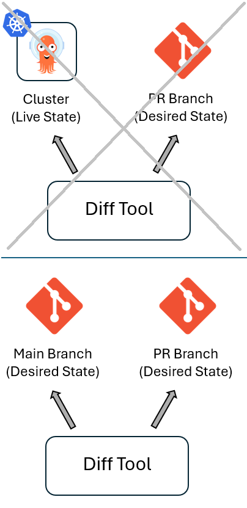

  </div>

  <div style="flex: 4; text-align: left;"> <!-- 33% Breite -->

#### Vergleich Desired State von zwei Branches → reproduzierbar
  * Nicht Live State (Temporärer Drift, Admission webhooks, Sync delays ...)
  * GitOps == Auto-sync aktiv → Vergleich mit Desired State genügt

#### Rendering mit Argo CD durchführen
  * Funktionalität sehr umfangreich, nicht sinnvoll außerhalb zu reproduzieren
  </div>
</div>

---

# Argo CD Diff Preview - Funktionsweise

Beispiel Ausführung

```bash [1-3|5-7|9-11,18|14-15|16-17]
# Get Argo CD Manifests on main branch
git clone https://github.com/dag-andersen/argocd-diff-preview \
          base-branch --depth 1 -q 

# Get Argo CD Manifests on target branch
git clone https://github.com/dag-andersen/argocd-diff-preview \
          target-branch --depth 1 -q -b helm-example-3

# Execute Argo CD Diff Preview (e.g. in a container)
docker run \
  --network host \
  -v /var/run/docker.sock:/var/run/docker.sock \
  -v $(pwd)/output:/output \
  -v $(pwd)/base-branch:/base-branch \
  -v $(pwd)/target-branch:/target-branch \
  -e REPO=dag-andersen/argocd-diff-preview \
  -e TARGET_BRANCH=helm-example-3 \
  dagandersen/argocd-diff-preview:v0.2.1
```

---

# Argo CD Diff Preview - Funktionsweise

Beispiel Ausführung Output


---

# Argo CD Diff Preview - Beispiel Ergebnis

Diff Preview als interaktives HTML als Pull Request Kommentar

<iframe data-src="assets/ch1_argocd_example_diff.html" 
        style="background: #0d1117; border: 1px solid #30363d; border-radius: 6px;" 
        width="800" height="500">
</iframe>

---

# Argo CD Diff Preview - Funktionsweise

<div style="display: flex; align-items: center; gap: 50px;" data-markdown>

  <div style="flex: 3;"> 
    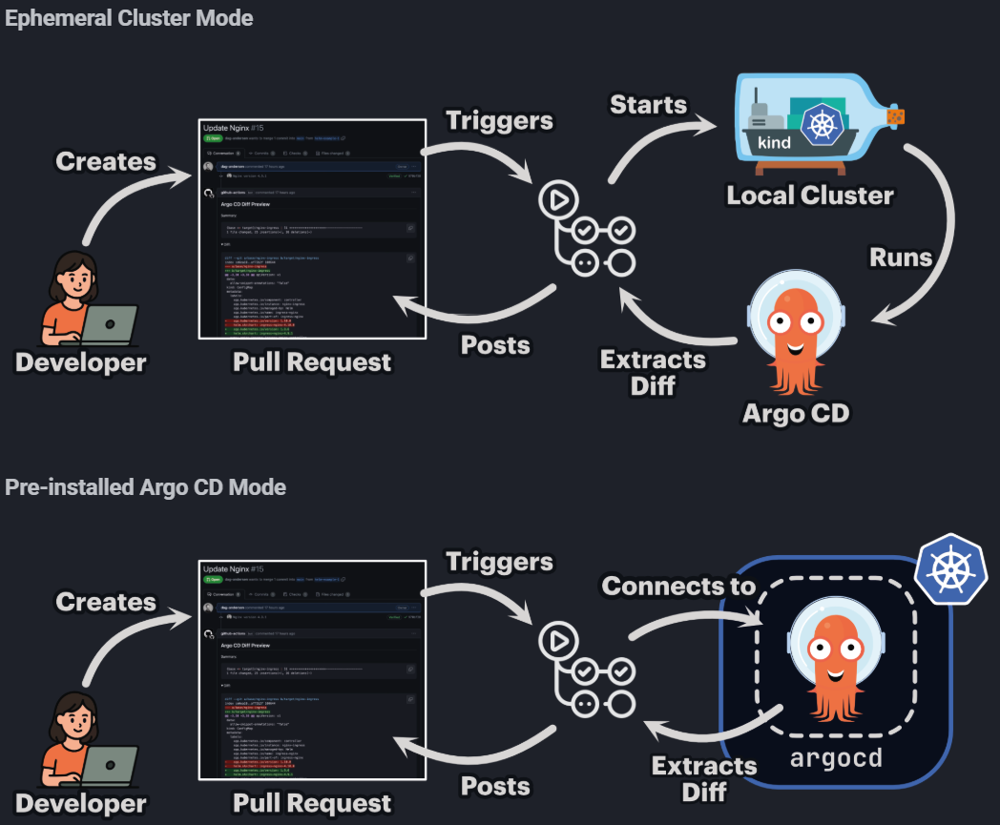
  </div>

  <div style="flex: 3; text-align: left;"> <!-- 33% Breite -->

### 1. Argo CD Instanz zum Rendern

#### Ephemeral
* Kind cluster erstellen
* Argo CD deployen

#### Pre-Installed
* Bereitstellen einer eigenen Argo CD Instanz
  </div>
</div>

---

# Argo CD Diff Preview - Funktionsweise

<div style="display: flex; align-items: center;" data-markdown>

  <div style="flex: 3;"> 
    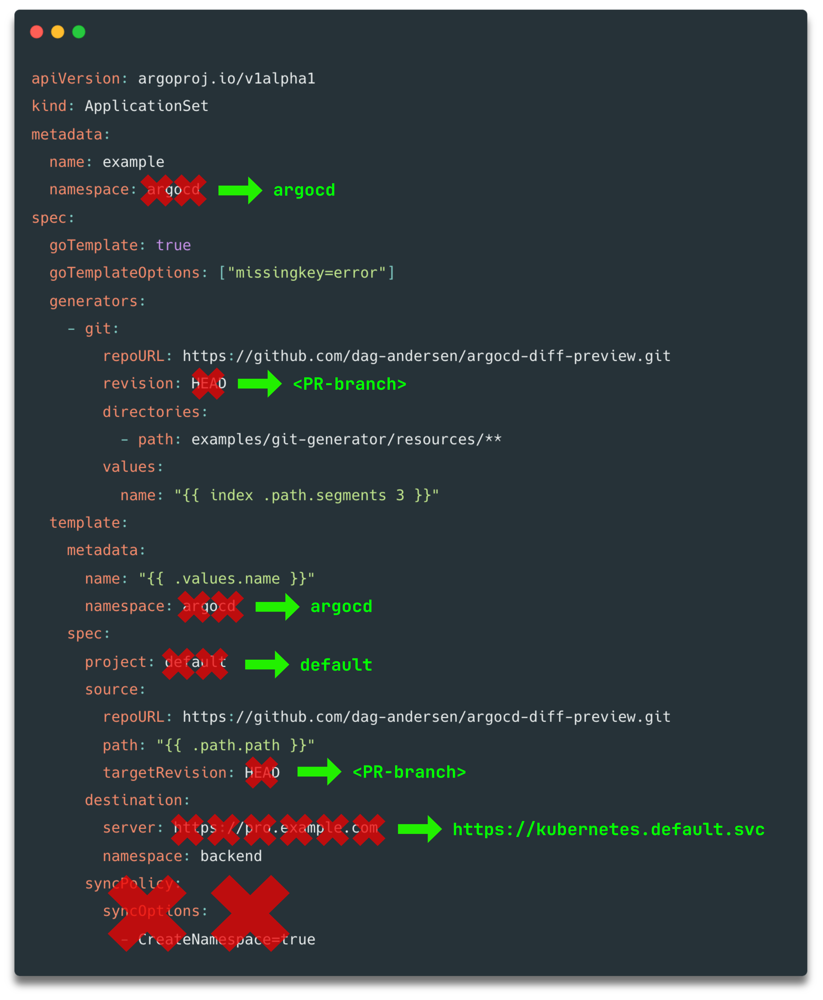
  </div>

  <div style="flex: 2; text-align: left;"> <!-- 33% Breite -->

### 2. Application Manifests vorbereiten

* Fetch
* Select/Filter
* Patch 
  </div>
</div>

---

# Argo CD Diff Preview - Funktionsweise

<div style="display: flex; align-items: center; gap: 50px;" data-markdown>

  <div style="flex: 2;"> 
    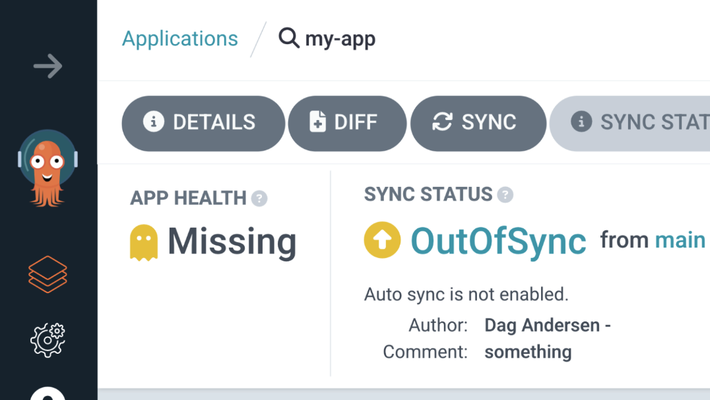
  </div>

  <div style="flex: 3; text-align: left;"> <!-- 33% Breite -->

### 3. Argo CD Applications deployen

* ApplicationSets und App of Apps auflösen → Applications
* Rendern der Applications für main und change in Argo CD
* Applications erstellen aber Sync ist deaktiviert
* Extrahieren der zwei Varianten
  ```bash
  argocd app manifests <app-name>
  ```
* Löschen der Applications
  </div>
</div>

---

# Argo CD Diff Preview - Funktionsweise

### 4. Diff erzeugen
Vergleich Main vs Target Branch per Argo CD Application:

* Hinzugefügte Applications - Neu im Target Branch
* Entfernte Applications - Gelöscht im Target Branch
* Geänderte Applications - Geändert zwischen Branches
* Unveränderte Applications - Unverändert (gefiltert im Output)

<div style="font-size: 0.6em; margin-top: 1em">

| File | Description |
| :--- | :--- |
| `./output/diff.md` | Markdown diff ... |
| `./output/diff.html` | HTML diff ... |
</div>

---

<!-- # Argo CD Diff Preview - Multi Repo Support

<div style="font-size: 0.6em;">

| Repository | Contains |
| :--- | :--- |
| Application Repo | Argo CD Application and ApplicationSet manifests |
| Resource Repo | Kubernetes resources (Helm charts, Kustomize overlays, plain YAML) |
</div>

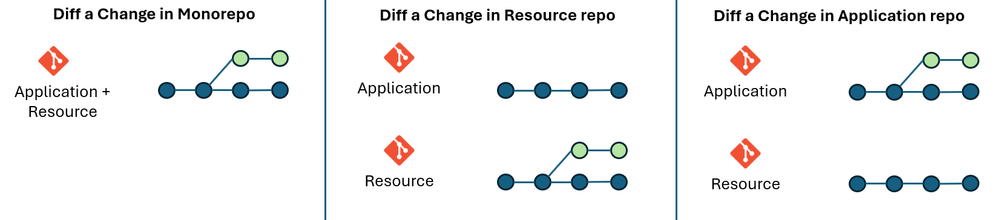

--- -->

# Kapitel 3: Ein produktives Setup

---

# Fokus auf
<div class="fragment">

## Performance
für Feedback im PR (Sekunden)
</div>

<div class="fragment">

## Security
produktiven Cluster absichern, CI Zugriffe
</div>

<div class="fragment">

## Maintenance | Operations
Aufwand minimieren
</div>

---

# Argo CD Installation für Diff Preview

<div style="text-align: left;" class="fragment">

### Ephemeral

* ✅ Kein Setup nötig
* ✅ Komplette Isolation
* ❌ Langsam (~60 Sekunden Overhead pro Run)
* ❌ Credentials in CI/CD pipeline

</div>

<div style="text-align: left;" class="fragment">

### Pre-Installed
* ✅ Schnelle Ausführung (Overhead nur Gitlab Runner Spin-up-time)
* ✅ Keine Cluster Credentials in CI/CD pipeline (Verwendung Service Account innerhalb des Clusters, Argo CD hat alle Credentials)
* ❌ Komplexer (braucht Self-hosted Runners + eigenes Argo CD)
</div>

---

# Argo CD Pre-installed

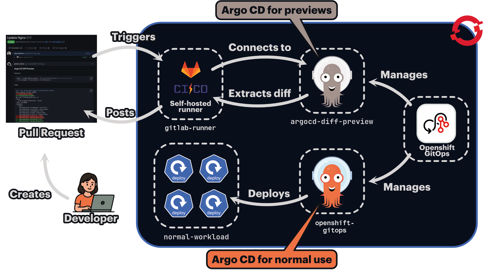

---

# Argo CD Pre-installed - Deployment

<div style="display: flex; align-items: center; gap: 50px;" data-markdown>
  <div style="flex: 3; text-align: left;" class="fragment"> <!-- 33% Breite -->

## Openshift GitOps Operator
* Deklarative Installieren der eigenen Instanz
* Gleiche Version wie produktives Argo CD
* Upgrades laufen mit

<div class="fragment">

## Configuration via GitOps

* Service Account (Gitlab runner access)
* RBAC Service Account
* SSH known hosts, TLS certs
* Repo Credential Templates (VSO|ESO)
* Cluster Credentials (VSO|ESO)
...
</div>
</div>

  <div style="flex: 1;" data-markdown> <!-- .element: class="fragment fade-up" -->
    

#### Namespaced 
#### (nicht cluster-wide)
  </div>
</div>
---

# Gitlab Runner image

Argo CD Diff Preview binary (kein DinD) + Dependencies

```dockerfile [6-11|13-17|19-23|25-31]
FROM registry.access.redhat.com/ubi10-minimal:latest

RUN microdnf install -y curl git tar unzip && \
    rm -rf /var/cache/yum/*

# argocd CLI (optional)
# only needed if using --render-method=cli
RUN curl -sSL -o argocd-linux-amd64 https://github.com/argoproj/argo-cd/releases/latest/download/argocd-linux-amd64 && \
    install -m 555 argocd-linux-amd64 /usr/local/bin/argocd && \
    rm argocd-linux-amd64 && \
    argocd version || true

# argocd-diff-preview CLI
RUN curl -LJO https://github.com/dag-andersen/argocd-diff-preview/releases/download/v0.2.1/argocd-diff-preview-Linux-x86_64.tar.gz && \
    tar -xvf argocd-diff-preview-Linux-x86_64.tar.gz && \
    mv argocd-diff-preview /usr/local/bin && \
    argocd-diff-preview --version

# kubectl CLI
# dependency of argocd-diff-preview, utilized by go k8s-client
RUN curl -LO https://dl.k8s.io/release/v1.34.0/bin/linux/amd64/kubectl && \
    install -m 555 kubectl /usr/local/bin/kubectl && \
    rm -f kubectl

# oc CLI
# utilized by runner to login to openshift with the argocd-diff-preview-access service account
# e.g. oc login --server "$OPENSHIFT_SERVER" -token="$ARGOCD_DIFF_PREVIEW_OPENSHIFT_SA_TOKEN"
RUN curl -L -o /tmp/oc.tar.gz https://mirror.openshift.com/pub/openshift-v4/clients/ocp/stable/openshift-client-linux.tar.gz && \
    tar -xzvf /tmp/oc.tar.gz -C /usr/local/bin oc && \
    chmod +x /usr/local/bin/oc && \
    rm -f /tmp/oc.tar.gz
```

---

# Gitlab pipeline template

zentral, versioniert

```yaml [9|10-16|19-25|27-29|31-33|35-41|49-54|56-60|63-64]
default:
  tags:
    - openshift-gitlab-runner

stages:
  - diff

diff:
  image: <your-registry>/argocd-diff-preview-runner
  variables:
    ARGO_MANIFEST_REPO: ""
    ARGO_MANIFEST_REPO_TARGET_BRANCH: ${CI_MERGE_REQUEST_SOURCE_BRANCH_NAME}
    K8S_MANIFEST_BRANCH: ${CI_MERGE_REQUEST_SOURCE_BRANCH_NAME}
    ARGOCD_DIFF_PREVIEW_FLAGS: ""  # e.g. "--debug"
    OPENSHIFT_CLUSTER: "<your-openshift-cluster-url>"
    GITLAB_TOKEN: $GITLAB_PAT
  script:
    - echo "******** Running analysis ********"
    # Repo location of the ArgoCD ApplicationSet manifests
    - |
      if [ -z "$ARGO_MANIFEST_REPO" ]; then
        ARGO_MANIFEST_REPO=${CI_REPOSITORY_URL}
      else
        ARGO_MANIFEST_REPO="https://$ARGOCD_DIFF_PREVIEW_REPO_USER:$ARGOCD_DIFF_PREVIEW_REPO_PASSWORD@$ARGO_MANIFEST_REPO"
      fi

    - git clone ${ARGO_MANIFEST_REPO} base-branch --depth 1  -q
    - git clone ${ARGO_MANIFEST_REPO} target-branch --depth 1 -q \
      -b ${ARGO_MANIFEST_REPO_TARGET_BRANCH}

    # initiate kubeconfig creation that argocd-diff-preview can use
    - oc login --server "$OPENSHIFT_CLUSTER" \
               --token="$ARGOCD_DIFF_PREVIEW_OPENSHIFT_SA_TOKEN"
    - |
      argocd-diff-preview \
        --repo ${CI_MERGE_REQUEST_PROJECT_PATH} \
        --base-branch main \
        --target-branch ${K8S_MANIFEST_BRANCH} \
        --argocd-namespace=argocd-diff-preview \
        ${ARGOCD_DIFF_PREVIEW_FLAGS} \
        --create-cluster=false
    - |
      # Deleting old PR comment if exists
      jq --null-input --rawfile msg $(pwd)/output/diff.md '{body: $msg}' > pr_comment.json
      NOTE_ID=$(curl --silent --header "PRIVATE-TOKEN: ${GITLAB_TOKEN}" \
          "${CI_API_V4_URL}/projects/${CI_PROJECT_ID}/merge_requests/${CI_MERGE_REQUEST_IID}/notes" | \
          jq '.[] | select(.body | test("Argo CD Diff Preview")) | .id')

      if [[ -n "$NOTE_ID" ]]; then
          echo "Deleting existing comment (ID: $NOTE_ID)..."

          curl --silent --request DELETE --header "PRIVATE-TOKEN: ${GITLAB_TOKEN}" \
              --url "${CI_API_V4_URL}/projects/${CI_PROJECT_ID}/merge_requests/${CI_MERGE_REQUEST_IID}/notes/${NOTE_ID}"
      fi

      echo "Adding new PR comment..."
      curl --silent --request POST --header "PRIVATE-TOKEN: ${GITLAB_TOKEN}" \
          --header "Content-Type: application/json" \
          --url "${CI_API_V4_URL}/projects/${CI_PROJECT_ID}/merge_requests/${CI_MERGE_REQUEST_IID}/notes" \
          --data @pr_comment.json > /dev/null

      echo "Comment added!"
  rules:
    - if: $CI_PIPELINE_SOURCE == "merge_request_event"
```

---

# Gitlab pipeline - Diff Preview Aktivierung

* opt-in (Aktivierung pro Pipeline)
* Minimale Konfiguration

```yaml []
stages:
  - argocd-diff-preview
include:
  - project: 'gitlab-ci-templates'
    ref: 'main'
    file: 'argocd-diff-preview-merge-request.yml'
diff:
  extends: .template-argocd-diff-preview
  stage: argocd-diff-preview
  variables:
    ARGOCD_DIFF_PREVIEW_FLAGS: "--debug  --max-diff-length 131072"
```

---

# Gitlab Runner Execution time

* Gitlab Runner ~10-20 Sekunden
* Diff Preview ~10 Sekunden


---

# Kapitel 4: Use Cases

---

## Zero-Change PR - Dupliziertes Helm Chart per env → Zentrales Chart

* Zentrales Chart + Value Files erstellen
* Argo CD Manifest auf Chart + Value File umstellen

<div class="r-stack">
  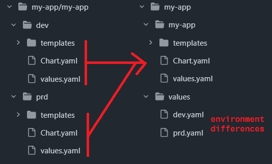
  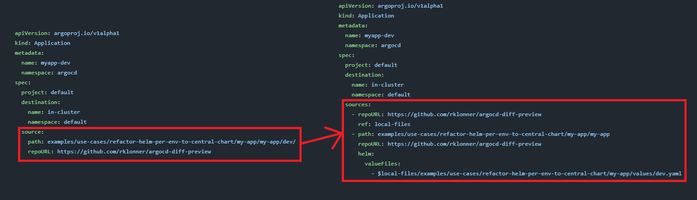
  
  
  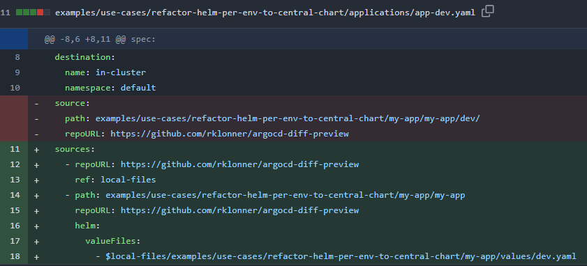
</div>

---

## Zero-Change PR - Dupliziertes Helm Chart per env → Zentrales Chart

Problem: Prd ServiceAccount und Service haben "dev" Suffix...

<iframe data-src="assets/ch4_uc_helm_per_env_to_central_chart_diff_preview.html" 
        style="background: #0d1117; border: 1px solid #30363d; border-radius: 6px;" 
        width="800" height="500">
</iframe>

---

##  Zero-Change PR - Dupliziertes Helm Chart per env → Zentrales Chart

```yaml [5]
{{- if .Values.serviceAccount.create -}}
apiVersion: v1
kind: ServiceAccount
metadata:
  name: myapp-dev
  labels:
    {{- include "myApp.labels" . | nindent 4 }}
```

bei einer Ressource kein Templating im Namen

```yaml
myapp-{{ .Values.environment }}
```

---

## Zero-Change PR - Kustomize Refactoring

Änderung die durch alle Overlays promotet wurde → Back-to-Base

<div class="r-stack">
  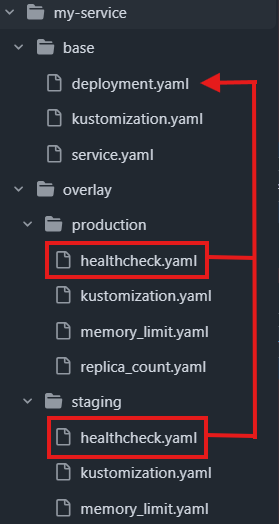
  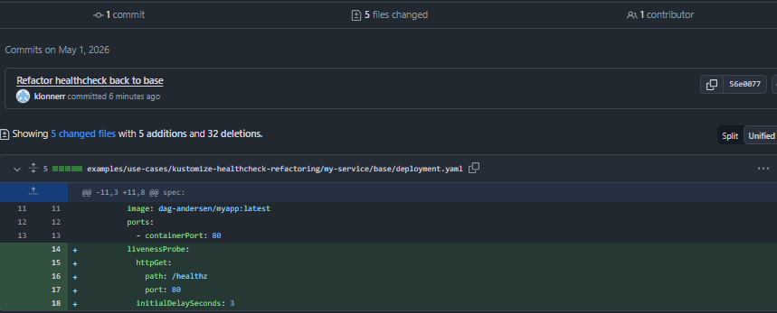
  
  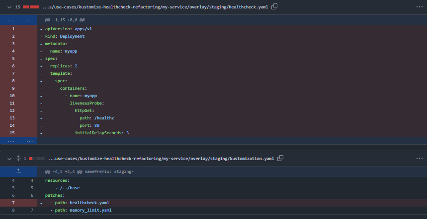
</div>

---

## Zero-Change PR - Kustomize Refactoring

Keine Änderung - Erfolgreiches Refactoring!

<iframe data-src="assets/ch4_uc_kustomize_backtobase_diff_preview.html" 
        style="background: #0d1117; border: 1px solid #30363d; border-radius: 6px;" 
        width="800" height="500">
</iframe>

---

## Produktline mit einem ApplicationSet deployen

Verifikation für Onboarding eines neuen Projects 

<div class="r-stack">
  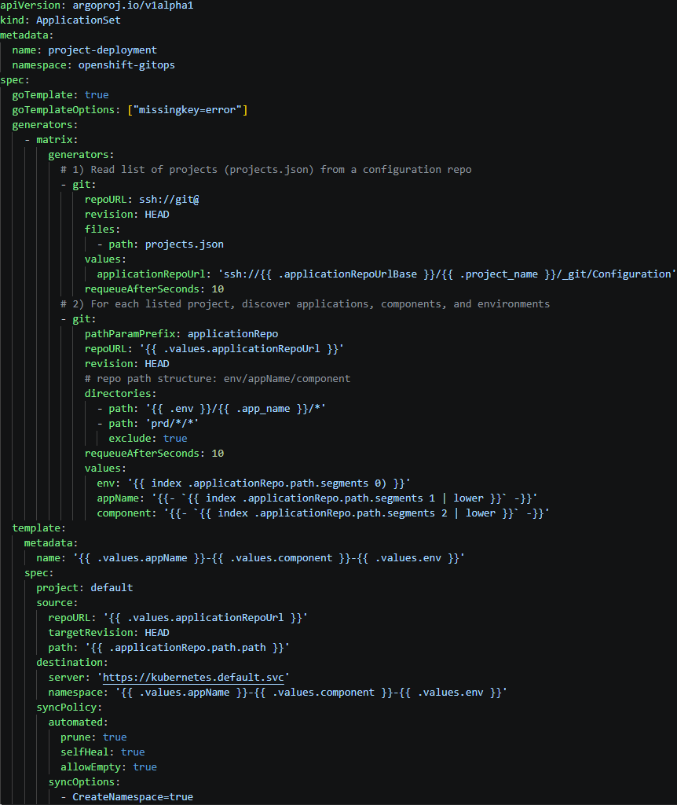
  <div class="fragment">

```yaml [10-12|14-17|20|24]
apiVersion: argoproj.io/v1alpha1
kind: ApplicationSet
metadata:
  name: project-deployment
spec:
  generators:
    - matrix:
        generators:
          # 1) Read list of projects (projects.json) from a configuration repo
          - git:
              files:
                - path: projects.json
          # 2) For each listed project, discover applications, components, and environments
          - git:
              # repo path structure: env/appName/component
              directories:
                - path: '{{ .env }}/{{ .app_name }}/*'
  template:
    metadata:
      name: '{{ .values.appName }}-{{ .values.component }}-{{ .values.env }}'
    spec:
      destination:
        server: 'https://kubernetes.default.svc'
        namespace: '{{ .values.appName }}-{{ .values.component }}-{{ .values.env }}'
```
</div>

  
</div>

---

## Produktline mit einem ApplicationSet deployen

Projekt und Applikation wurde gefunden und korrekt gerendert

<iframe data-src="assets/ch4_uc_appset_projects.html" 
        style="background: #0d1117; border: 1px solid #30363d; border-radius: 6px;" 
        width="800" height="500">
</iframe>

---

## Zusammenfassung - Argo CD Diff Previews

<div style="text-align: left; font-size: 0.8em; width: fit-content; margin: 0 auto;"">

<div class="fragment">

### Anwendung
* Einfache bis komplexe Template-Änderungen vorab rendern
* Abfangen von Templating- Syntax- und Logik Fehlern
* Hilfreich für Refactoring- und Development Aufgaben
</div>

<div class="fragment">

### Pro
* Sichtbarkeit → man bekommt einen "Execution Plan" im PR
* Verifikation → weniger fehlerhafte Deployments im Cluster
* Schnellere Feedback Zyklen
* Reviewer enablen + detailliertes Audit im PR
</div>

<div class="fragment">

### Con
* Initialer Aufwand das Setup in CI + Cluster zu integrieren
</div>

<div class="fragment">

"Wer einmal mit Diff Previews gearbeitet hat, möchte die gewonnene Sicherheit nicht mehr missen." 😀
</div>
</div>
---

# Fragen?

<div style="display: flex; align-items: center; gap: 50px;" data-markdown>

  <div style="flex: 1;" data-markdown>

  #### Feedback Vortrag

  
  </div>

  <div style="flex: 1;">

  #### Let's connect

  
  </div>

  <div style="flex: 1;">

  #### I want to try a demo

  
  </div>
</div>
